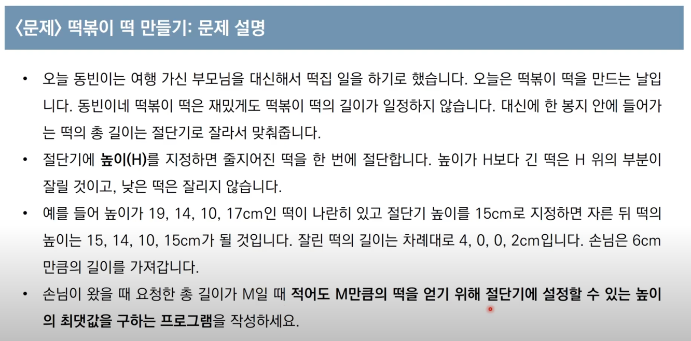
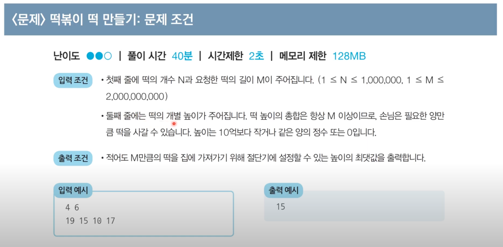
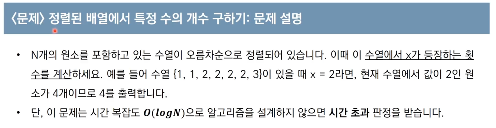
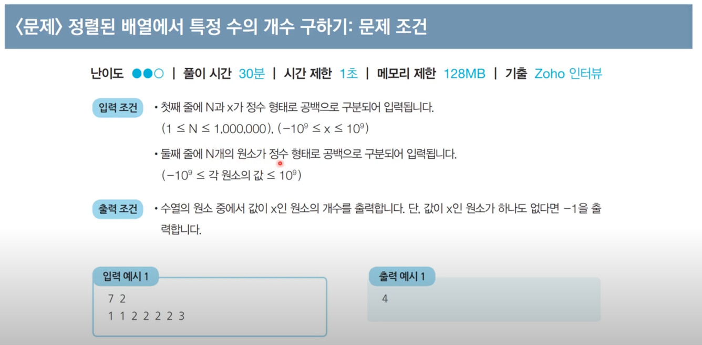

## Binary Search

### 📌 문제 1. 떡볶이 떡 만들기

___

### 📌 문제 2. 정렬된 배열에서 특정 수의 개수 구하기

___

### 📌 문제 3. 수 찾기 (백준 이진 탐색 유형)\

#### URL = https://www.acmicpc.net/problem/1920

___

### 📌 문제 4. 숫자 카드 2 (백준 이진 탐색 유형)

#### URL = https://www.acmicpc.net/problem/10816

___

### 📌 문제 5. 나무 자르기 (백준 이진 탐색 유형)

#### URL = https://www.acmicpc.net/problem/2805

___

### 📌 문제 6. 랜선 자르기 (백준 이진 탐색 유형)

#### URL = https://www.acmicpc.net/problem/2805

___

### 📌 문제 7. 좋다 (백준 이진 탐색 유형)

#### URL = https://www.acmicpc.net/problem/1253

___

