## DP

### 📌 문제 1. 개미 전사

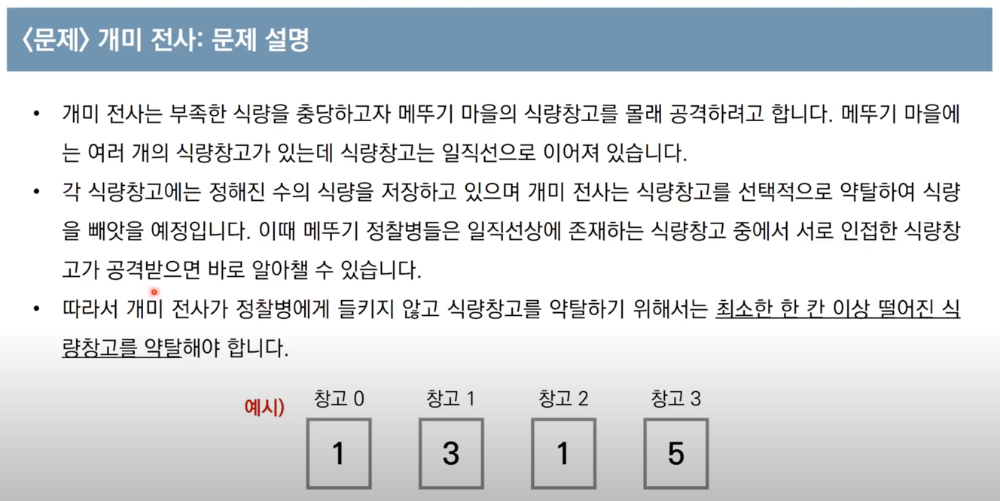

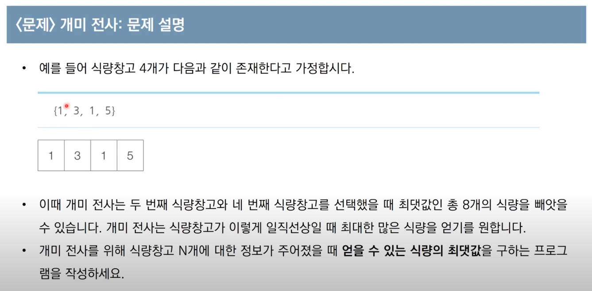

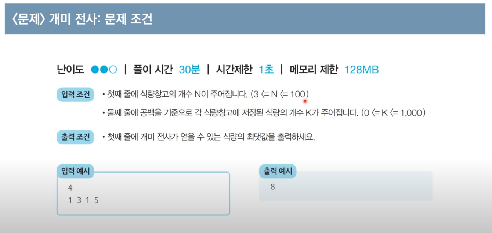

___

### 📌 문제 2. 1로 만들기

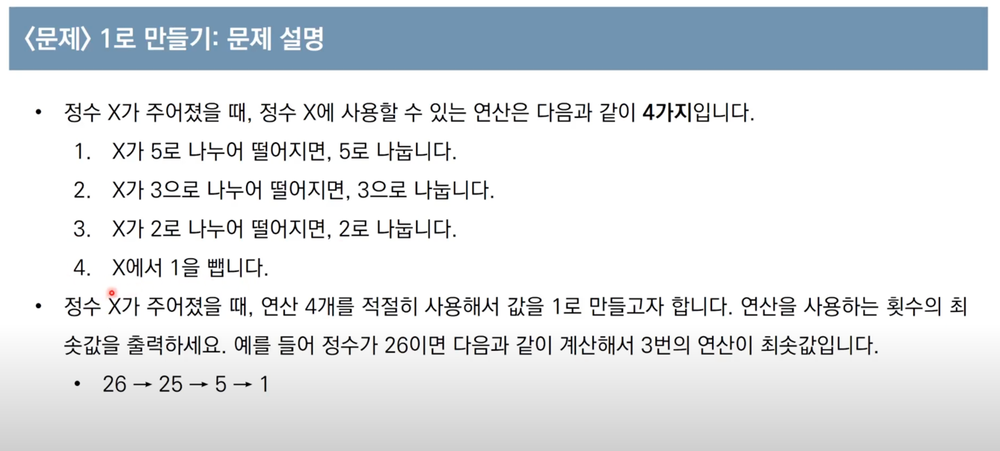

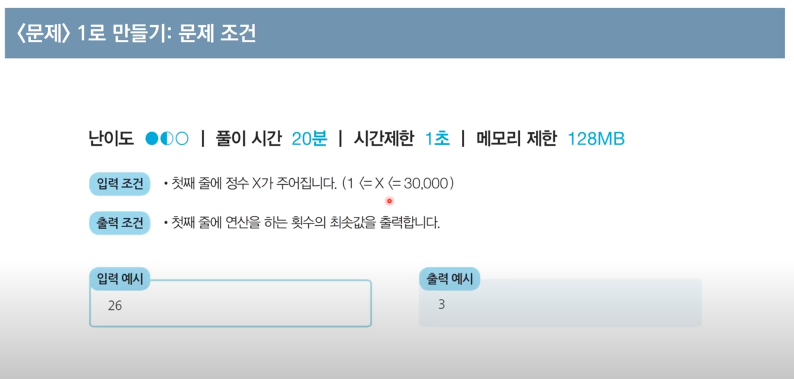

___

### 📌 문제 3. 효율적인 화폐 구성

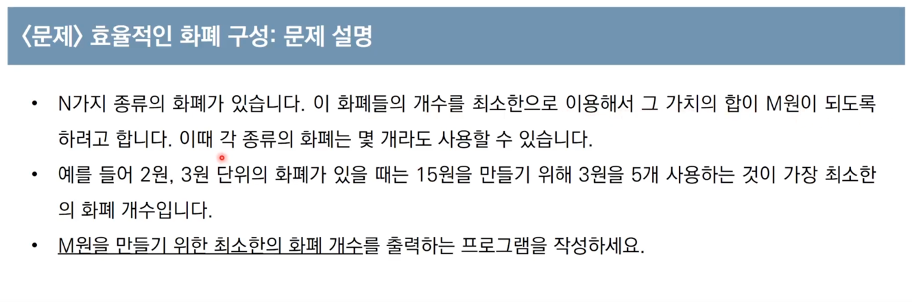

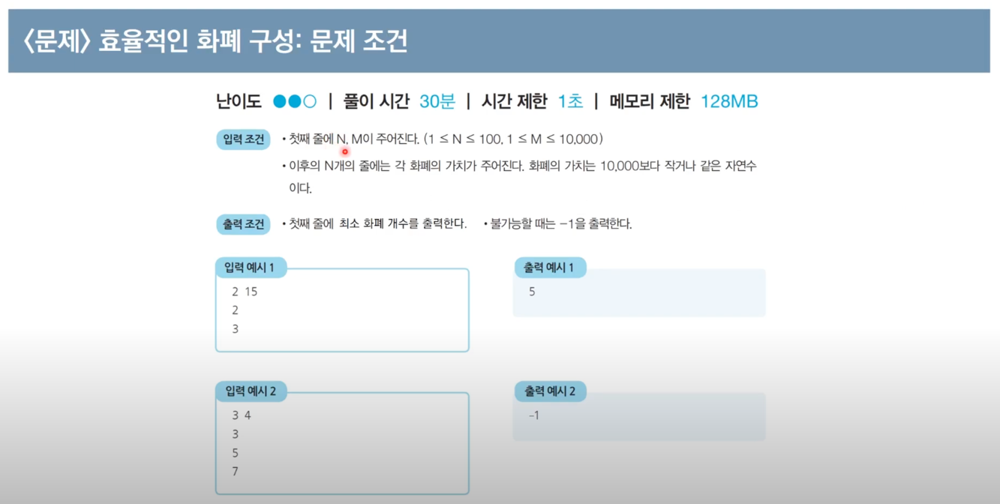

___

### 📌 문제 4. 금광

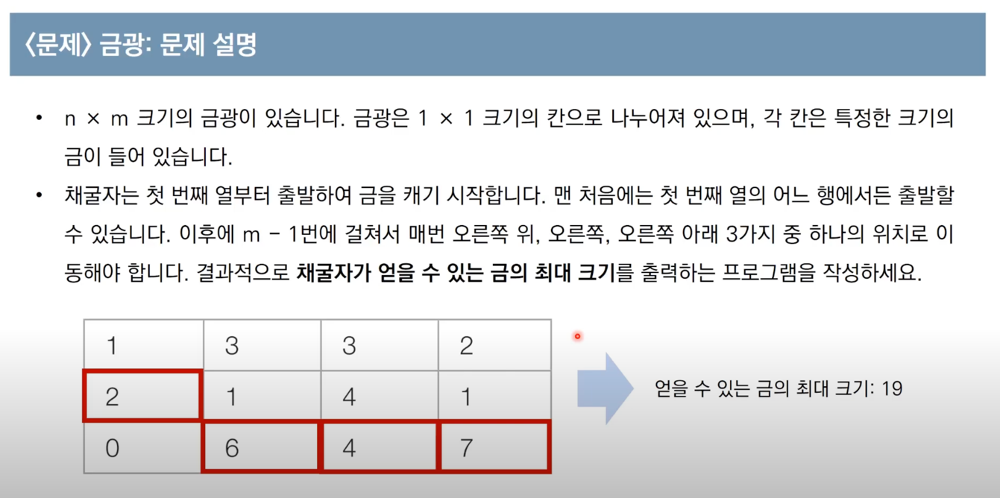

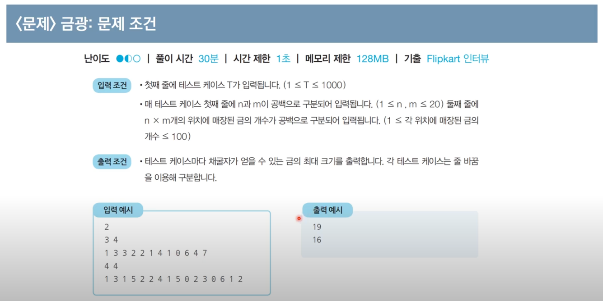

___

### 📌 문제 5. 병사 배치하기

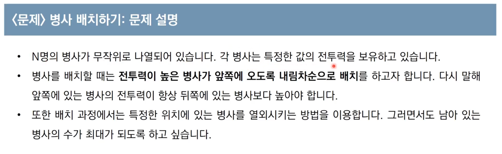

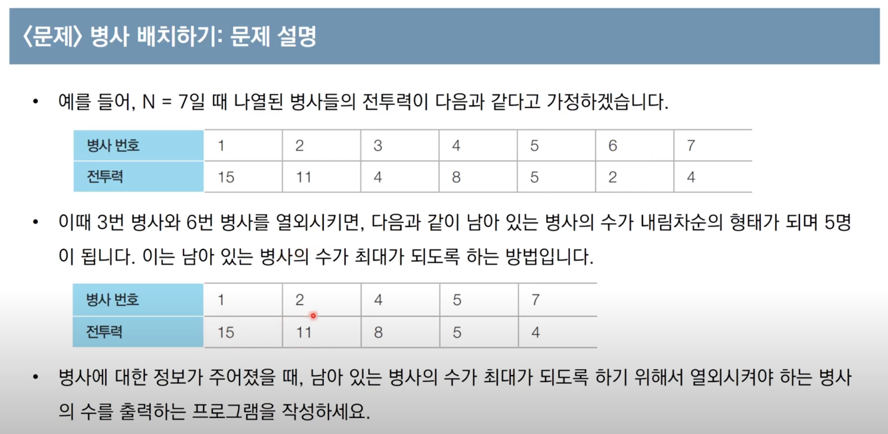

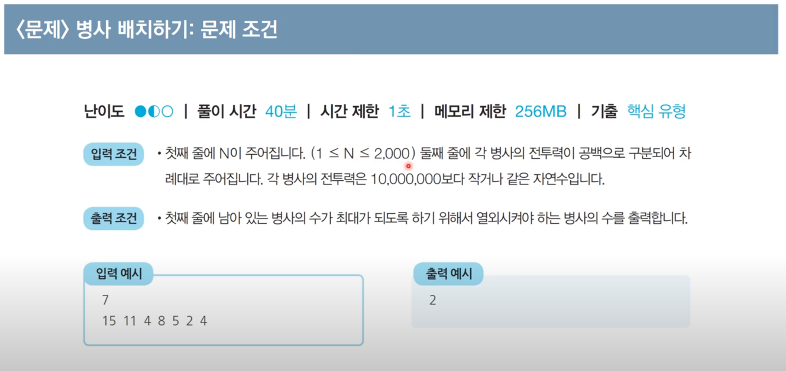

___

### 📌문제 6. 1, 2, 3 더하기

#### URL = https://www.acmicpc.net/problem/9095

___

### 📌문제 7. 피보나치 함수

#### URL = https://www.acmicpc.net/problem/1003

___

### 📌문제 8. 2xn 타일링

#### URL = https://www.acmicpc.net/problem/11726

___

### 📌문제 9. 피보나치 수

#### URL = https://www.acmicpc.net/problem/2747

___

### 📌문제 10. 가장 긴 증가하는 부분 수열 4

#### URL = https://www.acmicpc.net/problem/14002

___