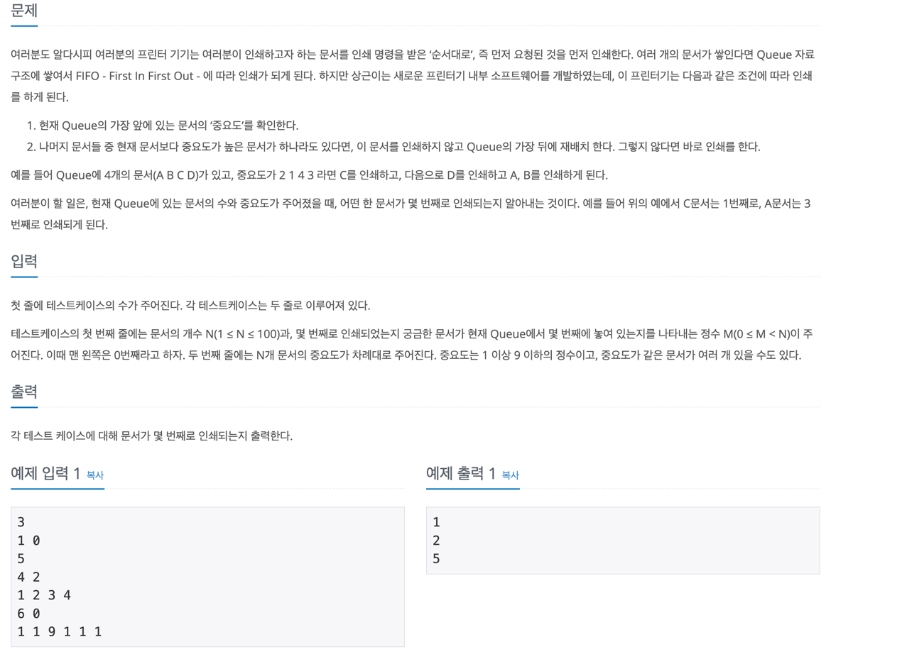
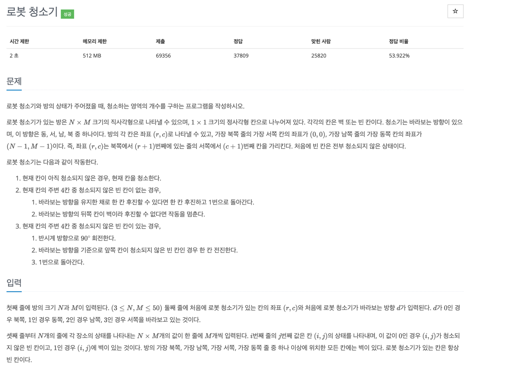
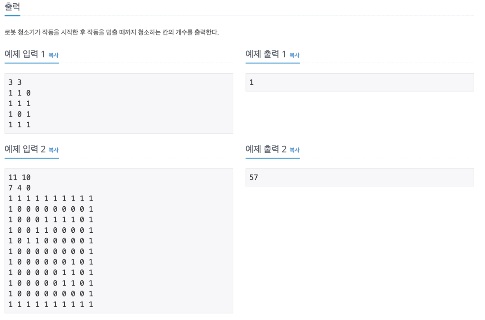
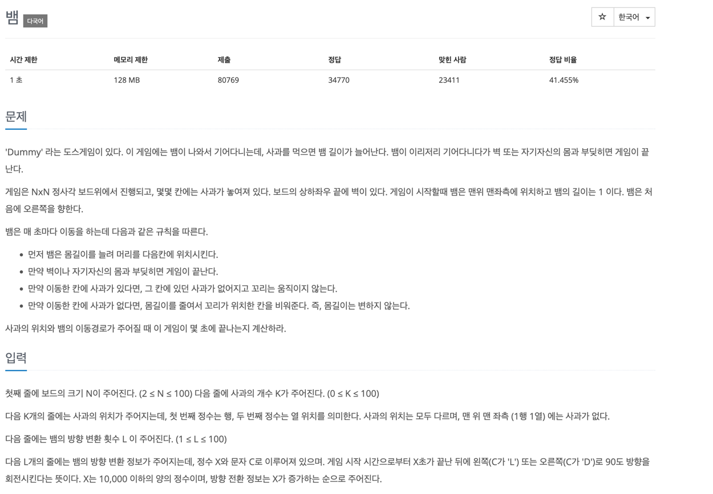

## Implement 문제

 

### 📌 문제 1. 상하좌우

 

___

### 📌 문제 2. 시각

 

___

### 📌 문제 3. 왕실의 나이트

___

### 📌 문제 4. 문자열 재정렬

___

### 📌 문제 5. 프린터 큐

___

### 📌 문제 6. 로봇청소기

___

### 📌 문제 7. 뱀

예제 입력 1: 
6
3
3 4
2 5
5 3
3
3 D
15 L
17 D

출력 1: 9

예제 입력 2:
10
4
1 2
1 3
1 4
1 5
4
8 D
10 D
11 D
13 L

출력 2: 21

예제 입력 3:
10
5
1 5
1 3
1 2
1 6
1 7
4
8 D
10 D
11 D
13 L

출력 3: 13
___

### 📌 문제 8 . 미세먼지 안녕!

URL = https://www.acmicpc.net/problem/17144
___

### 📌 문제 9. 치즈 

URL = https://www.acmicpc.net/problem/2636
___

### 📌 문제 10. 빗물 

URL = https://www.acmicpc.net/problem/14719
___
