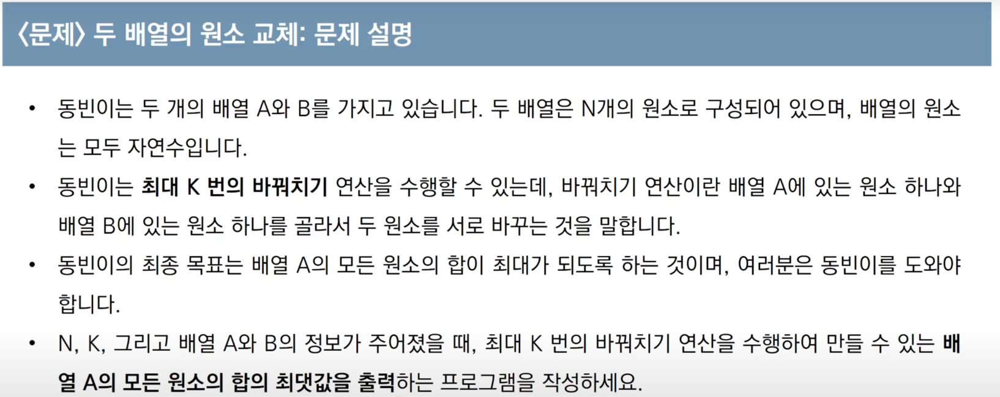
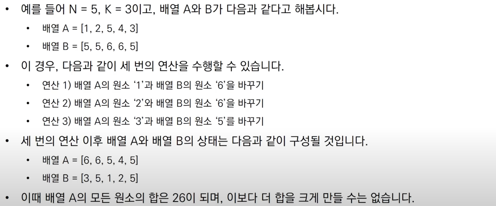
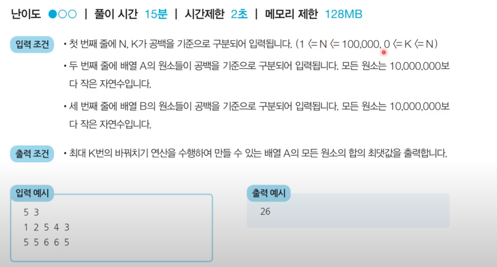

## Sort

### 📌 문제 1. DFS와 BFS

___

### 📌 문제 2. 수 정렬하기

#### URL = https://www.acmicpc.net/problem/2750 

___

### 📌 문제 3. 수 정렬하기2

#### URL = https://www.acmicpc.net/problem/2751 

___

### 📌 문제 4. 단어 정렬

#### URL = https://www.acmicpc.net/problem/1181

___

### 📌 문제 5. 수 찾기

#### URL = https://www.acmicpc.net/problem/1920

___